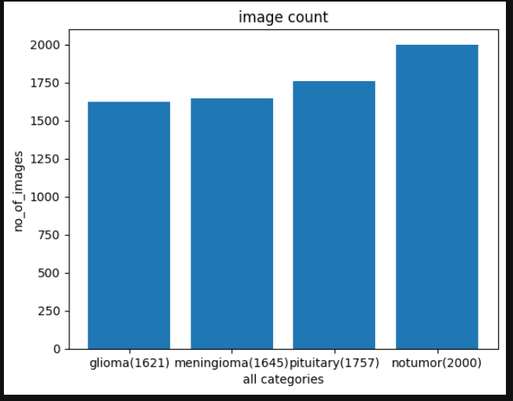
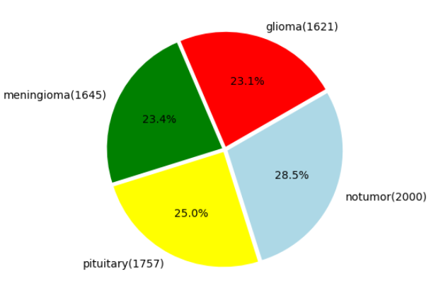
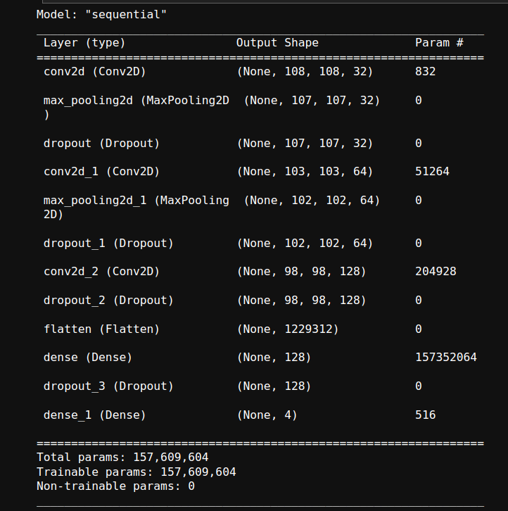
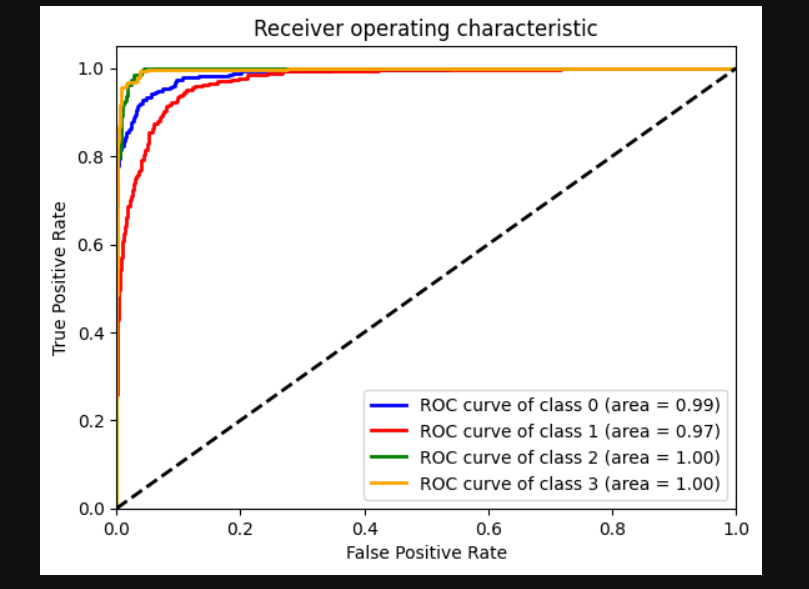
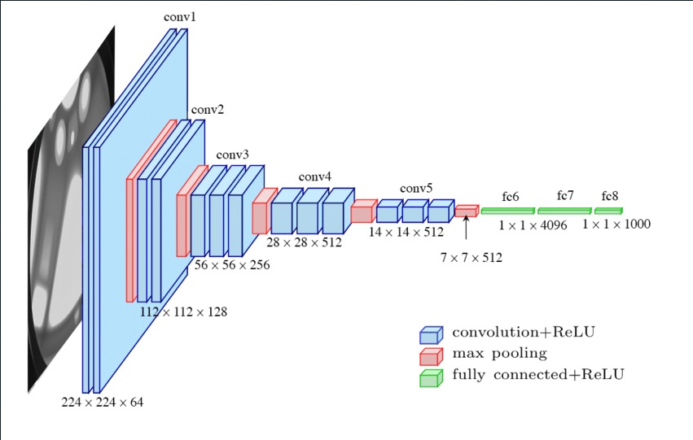
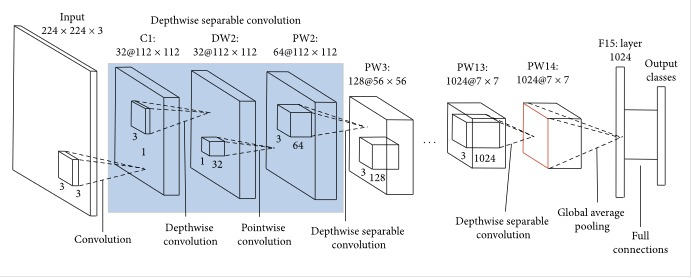

<!--
---
layout: post
title: "Brain Tumor Detection and Classification"
description: "Benchmarking different models to detect and classify brain tumors"
categories: Envision
thumbnail: "https://storage.googleapis.com/kaggle-datasets-images/1608934/2645886/44583c7826d1bdea68598f0eef8e6cfc/dataset-cover.jpg?t=2021-09-25-22-03-08"
year: 2023
---

### Mentors

- Bharadwaja M Chittapragada
- Charu Samir Shah

### Members

- Aishini Bhattacharjee
- Abhijith D Kumble
- Lasya Reddy
- Mahitha Kankatala

## Acknowledgements

Special thanks to Ashish Bharath and the seniors for guiding us during the project.
-->

## Aim

> Brain tumors are a severe disease that affects thousands of people globally. Early detection and accurate diagnosis of brain tumors can greatly improve the chances of survival and recovery. The goal of this project is to benchmark different exisiting models and to build a custom model that can assist radiologists in the diagnosis of brain tumors. 

By automating the classification of brain tumors in MRI images, the model can reduce the time and effort required for diagnosis and improve the accuracy of the diagnosis. We used a dataset of 7022 MRI images of the human brain, which are labeled into 4 classes: 

- glioma 
- meningioma 
- pituitary and
- no tumor 

## Introduction
We followed the following steps for prediction:
- Data preprocessing: The first step was to preprocess the dataset. This included tasks such as splitting the dataset into training, validation and test sets, normalizing the images, and handling any missing data.
- Data augmentation: To increase the size of the dataset, data augmentation techniques such as rotation, flipping and zoom were applied to the images. This helped to prevent overfitting and improve the generalization of the model.
- Feature extraction: The next step was to extract features from the images. This was done using techniques such as convolutional neural networks (CNNs) or transfer learning. These features were used as input to the classification model.
- Model selection and training: We then selected a suitable model for classification. Trained the CNN model using the training set and evaluated its performance using the validation set. 

We then increased the complexity of the algorithm used in the following order
<ol type="a">
  <li>Multi Class Logistic regression</li>
  <li>Support Vector Classifierea</li>
  <li>Convolutional Neural networks</li>
  <li>Pre-trained models like MobileNet, Inception-v3, and VGG -16.</li>
</ol>

- Hyperparameter tuning: Fine-tuned the model's hyperparameters, such as the number of layers or the learning rate, to improve its performance.
- Model evaluation: Evaluated the final model's performance on the test set. Measured the model's accuracy, precision, recall and F1-score, and compared it to the baselines.

## Different models

As mentioned above we implemented the following models the order after basic EDA ( Exploratory data analysis) and image preprocessing such as normalization of the images. We compared the number of images in each class and went ahead with the classification task.

### <u>Multi-class Logisitic Regression</u>

We started off with a very basic multi-class logistic classifier model where we gave the pixel values as input and ran it for 50k iterations and surprisingly got a 85.59% accuracy on it.

### <u>Custom CNN's</u>

We then proceed to code custom CNN models which were coded using Sequential API of Tensflow. We tried out different methods to prevent overfitting of the model over data set.
Below is the models that were tried out and the results we obtained.

#### <u>3 layered - Batch normalization</u>

Batch normalization is a technique used in deep learning to stabilize and accelerate the training of neural networks. It normalizes the input data by subtracting the batch mean and dividing by the batch standard deviation. This ensures that the input to each layer of the network has a consistent distribution, which helps alleviate the "internal covariate shift" problem. By reducing the dependence on the initialization of network weights and improving gradient flow, batch normalization enables faster convergence and better generalization of the model.

Here is the architecture of the model used

And here are the results obtained

#### <u>3 layered - Dropout</u>

Dropout is a regularization technique used in neural networks to prevent overfitting. During training, a random subset of neurons is temporarily ignored or "dropped out" with a specified probability. This forces the network to learn robust and more general features by preventing individual neurons from relying too heavily on specific inputs. Dropout acts as an ensemble method by training multiple subnetworks, which helps in reducing the effect of co-adaptation of neurons and improves the overall generalization performance of the network.

Here is the architecture of the model used

And here are the results obtained

### <u>VGG16</u>

VGG (Visual Geometry Group) Network: The VGG network is a deep neural network architecture that was introduced by researchers at the University of Oxford in 2014. It is known for its simplicity and ease of implementation, consisting of only a few layers with small filters. The VGG network was one of the top-performing models in the 2014 ImageNet competition.
The VGG network was also trained on the ImageNet dataset, and has been used for various image classification tasks, including medical image classification.

### <u>MobileNet</u>

MobileNet: MobileNet is a neural network architecture designed for mobile and embedded devices that have limited computational resources. It was introduced by Google researchers in 2017 and is known for its small size and high efficiency.
MobileNet uses a combination of depthwise separable convolutions, which separate the convolution operation into two separate steps: a depthwise convolution and a pointwise convolution. This reduces the number of parameters and computation required, while maintaining the overall accuracy of the model.

### <u>Inception-v3</u>

Inception-v3: Inception-v3 is a deep neural network architecture that was introduced by researchers at Google in 2015. It is a variant of the original Inception architecture that uses a combination of convolutional layers of different sizes to improve performance. Inception-v3 also includes additional features such as batch normalization and dropout to improve generalization.Inception-v3 was also originally trained on the ImageNet dataset, and has been used for a variety of image classification tasks, including medical image classification.

## Additional Extensions

( We also aim to build a frontend webapp which shows benchmarking of the results and if possible where one can upload an image of a MRI scan and it will classify the image into either one of the 4 classes.) 

- We use streamlit for the frontend display of the web-app

## Conclusion 

The following are the results we obtained on using different models:

| Model    | Accuracy |
| -------- | ------- |
| Logistic Regression  | 85.59%    |
| CNN (3 - layered with Drop-Out) | 91.35%     |
| CNN (3 - layered with Batch Normalization)    | 92.42%    |
| MobileNet    | 89.02%    |
| VGG-16    | ~97 % to 98%   |
| Inception-v3    | 96.87%    |

## References

- Research paper - https://ieeexplore.ieee.org/stamp/stamp.jsp?tp=&arnumber=8934603
- Machine Learning Basics - https://in.coursera.org/learn/machine-learning-course
- Deep Learning Basics - https://youtube.com/playlist?list=PLZbbT5o_s2xq7LwI2y8_QtvuXZedL6tQU
- Convolutional Neural Networks - https://www.coursera.org/learn/convolutional-neural-networks?#syllabus
- Inception-v3: https://www.tensorflow.org/api_docs/python/tf/keras/applications/InceptionV3
- VGG: https://www.tensorflow.org/api_docs/python/tf/keras/applications/VGG16
- Mobile Net: https://www.tensorflow.org/api_docs/python/tf/keras/applications/mobilenet/MobileNet
